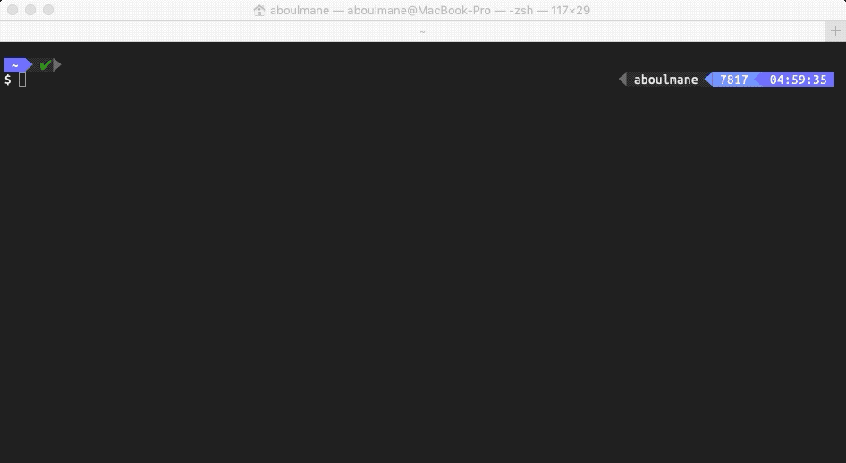

# occ-layout-manager for [Oracle Commerce Cloud](https://cloud.oracle.com/en_US/commerce-cloud "Oracle Commerce Cloud")

[](https://travis-ci.org/oracle-commerce-cloud/occ-layout-manager)
[](https://codeclimate.com/github/oracle-commerce-cloud/occ-layout-manager/maintainability)
[](https://coveralls.io/github/oracle-commerce-cloud/occ-layout-manager?branch=master)

A tool to manage [OCC](https://cloud.oracle.com/en_US/commerce-cloud "Oracle Commerce Cloud")'s 
layouts and widget instances, by automating the repetitive tasks, that can only be done manually through the administration interface.


## Installation
```$xslt
npm i -g
```

## Instructions   

```
Usage: olm -n [sourceserver] -k [keys]

A tool to manage OCC's layouts and widget instances.

Options:
  -n, --node <node>           URL for the Commerce Cloud administration interface, for example, http://localhost:9080
  -k, --applicationKey <key>  The application key to use to log in to the Commerce Cloud administration interface
  -l, --locale <iso>          default: en, values: en, fr
  -h, --help                  output usage information
```
## Examples

#### Instance oparations: Replace an instance by another one. 


